<div align="center">
  
# 💫 Hi, I'm Shubham Kumar Ray


</div>

<br>

<p align="center">
  
  
  
</p>

<br>

<div align="center">
  
  
  
</div>

<br>

## 🎯 About Me


<br>

🚀 **Passionate Java Full Stack Developer** focused on building robust and scalable web applications

🎓 Currently mastering **Spring Boot**, **React**, and **System Design** to become an industry-ready developer

💼 Working on **Voting Survey System** - A full-stack project demonstrating real-world application development

💡 Love solving complex problems with **clean code** and **efficient algorithms**

🌱 Learning **Microservices Architecture** and exploring **Cloud Technologies**

🎯 **2025 Goal:** Build 3 production-ready projects and contribute to open-source

📧 **Email:** shubhairmen@gmail.com

📍 **Location:** India 🇮🇳

⚡ **Fun Fact:** I believe the best code is written after coffee ☕

<br>
<br>


<br>

## 🛠️ Tech Stack & Skills

<div align="center">

### 💻 Programming Languages


### 🔧 Backend Technologies


### 🎨 Frontend Technologies


### 🗄️ Databases


### 🛠️ Tools & IDEs


</div>

<br>


<br>

## 🚀 Featured Project

<div align="center">

### 🗳️ **Voting Survey System**

<br>


<br>
<br>


<br>

**A full-stack web application for creating, managing, and participating in surveys with real-time voting capabilities**

<br>

</div>

### ✨ Key Features

```
✅ Create & Manage Multiple Surveys
✅ Real-Time Vote Counting & Analytics
✅ Duplicate Voting Prevention System
✅ Admin Dashboard for Survey Management
✅ RESTful API Architecture
✅ Responsive UI/UX Design
✅ Secure Authentication & Authorization
```

### 🎯 Technical Highlights

- **Backend:** Spring Boot with layered architecture (Controller → Service → Repository)
- **Frontend:** React with modern component-based design
- **Database:** MySQL with optimized schema design
- **API:** RESTful endpoints with proper HTTP methods
- **Security:** JWT-based authentication (planned)

<br>


<br>

## 📊 GitHub Statistics

<p align="center">
  
  
</p>
<p align="center">
  
  
</p>
<p align="center">
  
</p>


\\\\\\\\\\\\\\\\\\\\\\\\\\\\\\\\\\\\\\\\\\\\\\\\\\\\\\
<br>

<p align="center">
  
  
</p>

<br>

<p align="center">
  
  
</p>

<br>

<div align="center">
  


</div>

<br>


<br>

## 🐍 Contribution Snake

<div align="center">

<picture>
  <source media="(prefers-color-scheme: dark)" srcset="https://raw.githubusercontent.com/platane/snk/output/github-contribution-grid-snake-dark.svg" />
  <source media="(prefers-color-scheme: light)" srcset="https://raw.githubusercontent.com/platane/snk/output/github-contribution-grid-snake.svg" />
  
</picture>

</div>

<br>


<br>

## 🏆 GitHub Trophies

<div align="center">


</div>

<br>


<br>

## 💼 2025 Goals & Learning Roadmap

<div align="center">


### 🎯 My Goals for 2025

</div>

<br>

<table align="center">
<tr>
<td align="center" width="50%">

#### 📌 Short-Term Goals (Q1-Q2)

🚀 **Complete 1 Production-Level Full-Stack Projects**  
📚 **Master Spring Boot & Microservices Architecture**  
💡 **Solve 100+ DSA Problems on LeetCode/GFG**  
🌟 **Contribute to 2-3 Open Source Java Projects**  
📖 **Learn Docker & Containerization Basics**

</td>
<td align="center" width="50%">

#### 🎓 Long-Term Goals (Q3-Q4)

☁️ **Master AWS & Deploy Production Apps**  
🏗️ **Deep Dive into System Design & Scalability**  
🔐 **Learn Spring Security & JWT Authentication**  
📊 **Build a Personal Portfolio Website**  
🎯 **Become Senior Java Full Stack Developer**

</td>
</tr>
</table>

<br>

<div align="center">

### 📖 Current Learning Track

```mermaid
graph LR
    A[✅ Core Java] --> B[✅ Spring Boot]
    B --> C[🔄 React & Frontend]
    C --> D[🔄 Microservices]
    D --> E[📝 System Design]
    E --> F[📝 AWS & Cloud]
    
    style A fill:#FFAF05
    style B fill:#FFBF05
    style C fill:#FFAE05
    style D fill:#FFAG05
    style E fill:#FF0C05
    style F fill:#FF0P05
```


</div>

<br>



<br>

<div align="center">

**🎯 Focus Areas:** Clean Code Architecture | RESTful API Design | Database Optimization | Frontend-Backend Integration | Problem Solving

</div>

<br>


<br>

## 💻 Coding Profiles & Practice

<div align="center">

<!-- <a href="https://leetcode.com/u/Shubham-kumar-ray/000000https://leetcode.com/[Shubham-kumar-ray]" target="_blank"> -->
<a href="https://leetcode.com/u/Shubham-kumar-ray" target="_blank">
  
</a>
<a href="https://www.hackerrank.com/ShubhamRayy" target="_blank">
  
</a>
<a href="https://auth.geeksforgeeks.org/user/imsbmn" target="_blank">
  
</a>
<a href="https://www.codechef.com/users/shubham_rayy" target="_blank">
  
</a>

<br>
<br>


**💪 Actively solving DSA problems and improving problem-solving skills!**

</div>

<br>


<br>

## 🌐 Connect With Me

<div align="center">

<a href="https://linkedin.com/in/shubhamkumarray/" target="_blank">
  
</a>
<a href="https://x.com/shubhrayy" target="_blank">
  
</a>
<a href="mailto:your-shubhairmen@gmail.com">
  
</a>
<a href="https://yourportfolio.com" target="_blank">
  
</a>
<a href="https://www.instagram.com/your-handle" target="_blank">
  
</a>

<br>
<br>


</div>

<br>

## 💭 Random Dev Quote

<div align="center">


</div>

<br>


<br>

<div align="center">

## 🎵 Vibes While Coding

*"Code is like humor. When you have to explain it, it's bad!"* 💻✨


</div>

<br>


<br>

<div align="center">


<br>

## 🙏 Thanks for Visiting!


<br>
<br>


<br>

**If you like my work, consider giving a ⭐ to my repositories!**

<br>


<br>
<br>

**⭐ From [ShubhamKRay](https://github.com/ShubhamKRay) with 💙**

</div>
